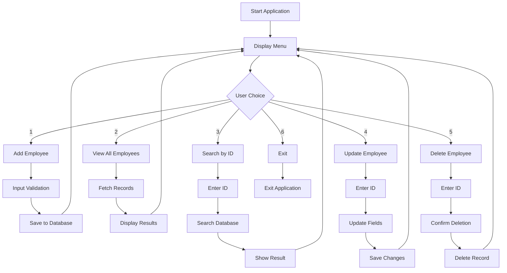

# 📊 Employee Database Management System (Java JDBC)
## Task 7:  Java JDBC – Employee Database App
This Employee Database Management System is a console-based Java application that demonstrates enterprise-level software development practices. The system provides a complete solution for managing employee records with secure database connectivity, comprehensive input validation, and professional error handling mechanisms.

---
## 🎪 Objective
Master Java database connectivity (JDBC) through practical implementation of CRUD operations while learning industry-standard coding practices, design patterns, and defensive programming techniques.

---
## ✨ Key Features
- **🔐 Secure Database Connection** - JDBC connection with connection pooling patterns
- **➕ Employee Creation** – Add new employees with validated inputs
- **📄 Employee Listing** – View all employees in the database
- **🔍 ID-Based Search** – Retrieve employees by unique ID
- **✏️ Record Management** – Update existing employee information
- **🗑️ Employee Deletion** – Remove records with confirmation prompt
- **✅ Input Validation** – Sanitize and validate all user inputs
- **🛡️ Null Safety** – Comprehensive null value handling
- **🔄 Auto-Retry Logic** - Intelligent retry mechanisms for user inputs
- **🎛️ Console Menu** – Intuitive text-based user interface
- **🚨 Error Recovery** - Graceful error handling and recovery

---
## 🛠️ Technology Stack
### 📌 Core Technologies
- ☕ Programming Language: Java 8+ 
- 🗄️ Database: MySQL 9.0+ 
- 🔌 Connectivity: JDBC (Java Database Connectivity)
- 💻 Development Environment: IntelliJ IDEA

### 📌 Design Patterns & Practices
- Data Access Object (DAO) Pattern: Implemented in EmployeeDAO.java to handle all database operations for the Employee entity.

- Model-View-Controller (MVC) Architecture (Partially followed)
    - Model: Employee.java
    - Controller: MenuOperations.java
    - View: Console outputs in EmployeeApp.java & MenuOperations.java
  
- Exception Handling Strategies: Implemented using try-catch blocks across DBConnection.java, EmployeeDAO.java, MenuOperations.java, and EmployeeApp.java to handle SQL, input, and general exceptions.
---
## 📁 Project Structure
```
Employee-Database-System/
├── src/
│   ├── DatabaseConnection.java   # Database connectivity
│   ├── Employee.java             # Employee model class
│   ├── EmployeeDAO.java          # Data Access Object
│   ├── InputValidator.java       # Input validation utilities
│   └── EmployeeApp.java          # Main application class
├── .gitignore
├── README.md                     # Project documentation
└── mysql-connector-j.jar         # JDBC driver
```
---
## ▶️ How to Run
1. 📥 Clone or Download the Project
```
git clone https://github.com/satwinder9069/Employee-Database-JDBC-App.git
cd Employee-Database-JDBC-App/src
```
2. ⚙️ Compile the Java Files
+ (Make sure you’re inside the Employee-Database-JDBC-App/src folder)
```
javac *.java
```
3. ▶️ Run the Application
```
java EmployeeApp
```
---

## 🔄 Program Flow

---

## 📱 Usage Examples
#### Add Employee:
```
==== Add New Employee ====
Name: Harshpreet Kaur
Email: harsh12@gmail.com
Department: IT
Salary: 55000
Employee added successfully!
```
#### Search/View Employee By ID:
```
Enter Employee ID: 1
Employee found: ID: 1, Name: Harshpreet Kaur, Email: harsh12@gmail.com, Department: IT, Salary: 55000.00
```
#### Update Employee:
```
Enter Employee ID: 1
Current Name: John Doe
New Name: John Smith
Employee Updated Successfully!!
```
---
## 🎓 Learning Outcomes
- JDBC connectivity and CRUD operations – Connects the Java app to MySQL database and allows you to Create, Read, Update, and Delete employee records.
- Object-Oriented Programming (DAO, encapsulation, SRP) – Organizes code using classes and objects:
    - DAO handles database operations separately.
    - Encapsulation keeps data safe using private fields and getters/setters.
    - SRP (Single Responsibility Principle) ensures each class has one clear purpose.
- Input validation, error handling, and resource management – Ensures user inputs are correct and safe, handles exceptions gracefully, and properly closes database connections to avoid resource leaks.

---
